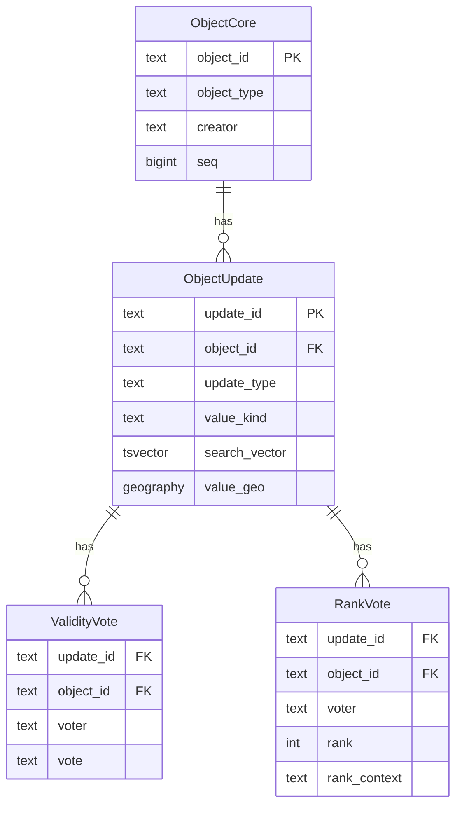
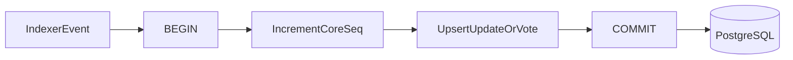
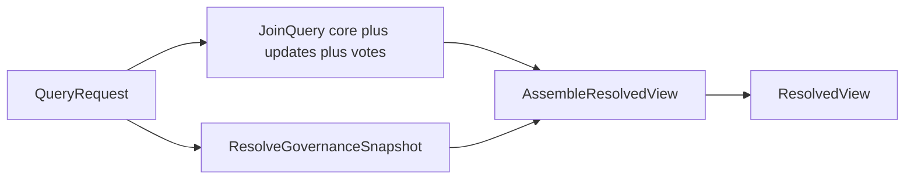

# PostgreSQL Concept: Collections and Flow

This document describes the PostgreSQL schema (four tables), write flow, read flow, and how it compares to [mongo-concept2](../mongo-concept2/). There is **no projection table** — the authoritative tables are queried directly using JOINs, `tsvector` full-text search, and PostGIS.

Related files:

- [shared-types.ts](shared-types.ts) — UpdateCardinality, ValidityVoteValue, ValueKind
- [objects-core.ts](objects-core.ts) — ObjectCoreRow
- [object-updates.ts](object-updates.ts) — ObjectUpdateRow
- [validity-votes.ts](validity-votes.ts) — ValidityVoteRow
- [rank-votes.ts](rank-votes.ts) — RankVoteRow
- [schema.sql](schema.sql) — Full DDL

## Roles of the tables

| Table | Role |
|-------|------|
| **objects_core** | Slim identity and metadata per object. `seq` incremented on every mutation. |
| **object_updates** | One row per active update. FK to objects_core ON DELETE CASCADE. Holds value (text/geo/json), plus `search_vector` (tsvector) and PostGIS `value_geo`. |
| **validity_votes** | One row per validity vote. FK to object_updates ON DELETE CASCADE — replacing an update deletes its votes automatically. |
| **rank_votes** | One row per rank vote. Same CASCADE. rank 1..10000 enforced by CHECK. |

The **resolved view** (final API response) is computed at request time from core + updates + votes + governance; it is not stored.

### Entity relationship



## Write flow

Writes run inside a single transaction. No projection step.



### Step 1: Upsert core row and increment seq

An object may not exist yet when the first event arrives. Use an upsert to create or increment atomically:

```sql
INSERT INTO objects_core (object_id, object_type, creator, weight, meta_group_id, seq)
VALUES ($1, $2, $3, $4, $5, 1)
ON CONFLICT (object_id) DO UPDATE SET seq = objects_core.seq + 1;
```

### Step 2: Upsert update or vote

- **update_create (single-cardinality)**  
  Replace the existing update for that object + update_type + cardinality:
  1. `DELETE FROM object_updates WHERE object_id = $1 AND update_type = $2 AND cardinality = 'single'` — CASCADE deletes validity_votes and rank_votes for that update.
  2. `INSERT INTO object_updates (...)` for the new update.  
  The trigger sets `search_vector` from `value_text`.

- **update_create (multi)**  
  `INSERT INTO object_updates (...)` — no delete; multi-cardinality accumulates rows.

- **update_vote**  
  `INSERT INTO validity_votes (...) ON CONFLICT (update_id, voter) DO UPDATE SET vote = EXCLUDED.vote, ...`

- **rank_vote**  
  `INSERT INTO rank_votes (...) ON CONFLICT (update_id, voter, rank_context) DO UPDATE SET rank = EXCLUDED.rank, ...`

All in the same transaction as the seq increment.

### Step 3: No projection

The authoritative tables are the query surface. No separate projection table to maintain.

## Read flow to ResolvedView

Single query path: resolve governance, then one JOIN query that returns core + updates + votes for the matching objects.



### Step 1: Resolve governance

Same as Mongo: resolve owner, admins, trusted, precedence. Request-scoped, not stored.

### Step 2: Query with filters

Use the appropriate filter on `object_updates`, then JOIN to load full data.

**Full-text search (candidates by text):**

```sql
SELECT DISTINCT ou.object_id
FROM object_updates ou
WHERE ou.search_vector @@ to_tsquery('english', $1);
```

**Geo proximity (candidates by location):**

```sql
SELECT DISTINCT ou.object_id
FROM object_updates ou
WHERE ou.value_geo IS NOT NULL
  AND ST_DWithin(ou.value_geo, ST_MakePoint($lon, $lat)::geography, $meters);
```

**Exact match by field type (case-insensitive, uses generated column):**

```sql
SELECT DISTINCT ou.object_id
FROM object_updates ou
WHERE ou.update_type = $1 AND ou.value_text_normalized = LOWER(TRIM($2));
```

**Type-scoped + sorted (e.g. list places by weight):**

```sql
SELECT oc.object_id, oc.object_type, oc.creator, oc.weight, oc.seq
FROM objects_core oc
WHERE oc.object_type = $1
ORDER BY oc.weight DESC NULLS LAST
LIMIT $2 OFFSET $3;
```

### Step 3: Load core, updates, and votes (four targeted queries)

A single 4-way JOIN (`objects_core LEFT JOIN object_updates LEFT JOIN validity_votes LEFT JOIN rank_votes`) produces a Cartesian product: if one update has 5 validity votes and 3 rank votes it generates 15 rows per update, requiring complex deduplication in the application. Use four separate queries instead:

```sql
-- 1. Core rows
SELECT * FROM objects_core WHERE object_id = ANY($objectIds);

-- 2. Updates
SELECT * FROM object_updates WHERE object_id = ANY($objectIds);

-- 3. Validity votes
SELECT * FROM validity_votes WHERE object_id = ANY($objectIds);

-- 4. Rank votes
SELECT * FROM rank_votes WHERE object_id = ANY($objectIds);
```

All four can be sent as a pipeline (single round-trip on most drivers). The application joins them in memory by `object_id` and `update_id`.

### Step 4: Assemble ResolvedView

Same as Mongo: group updates by update_type, resolve validity (votes + governance), resolve single/multi cardinality and ranking, apply visibility, shape API response.

## Index strategy

| Table | Index | Type | Purpose |
|-------|--------|------|---------|
| objects_core | object_id | PK / B-tree | Primary lookup |
| objects_core | (object_type, weight DESC) | B-tree | Type-scoped sorted listing |
| objects_core | (creator) | B-tree | Filter by creator |
| object_updates | update_id | PK / B-tree | Lookup by update |
| object_updates | (object_id, update_type) | B-tree | Load updates for an object |
| object_updates | search_vector | GIN | Full-text search |
| object_updates | value_geo | GiST | Geo proximity |
| object_updates | (update_type, value_text) | B-tree (partial) | Raw exact match by field type |
| object_updates | (update_type, value_text_normalized) | B-tree (partial) | Case-insensitive exact match |
| object_updates | (object_id, update_type) WHERE cardinality='single' | UNIQUE partial | Enforce one active update per object+type |
| validity_votes | (update_id, voter) | UNIQUE | One vote per voter per update |
| validity_votes | (object_id) | B-tree | Bulk load votes for an object |
| rank_votes | (update_id, voter, rank_context) | UNIQUE | One rank per voter per context |
| rank_votes | (object_id) | B-tree | Bulk load ranks for an object |

## Comparison to Mongo concept v2

| Aspect | Mongo concept v2 | PostgreSQL concept |
|--------|------------------|--------------------|
| Tables/collections | 5 (core, updates, validity_votes, rank_votes, projection) | 4 (no projection) |
| Projection | Separate document/table, must be kept in sync | None; query core tables directly |
| Single-cardinality replace | Manual cascade: delete votes, delete update, update projection | DELETE update; CASCADE removes votes; no projection |
| Consistency | seq + coreSeqAtBuild for drift detection | ACID; seq for change tracking only |
| Text search | Projection searchText or text index on projection | tsvector + GIN on object_updates |
| Geo search | Projection geoFields + 2dsphere | PostGIS geography + GiST on object_updates |
| Read path | Two-hop: query projection → load core + updates + votes | One-hop: filtered JOIN over core + updates + votes |
| Writes | Core seq → upsert → update projection (incremental or full) | Transaction: seq → upsert; no projection write |

## Consistency model

- **ACID**: Every write is one transaction. No drift between “core” and “projection” because there is no projection.
- **CASCADE**: Deleting an object or an update removes dependent rows in child tables automatically.
- **seq**: Kept for change tracking and optional consumers (e.g. incremental export); not required for correctness.
