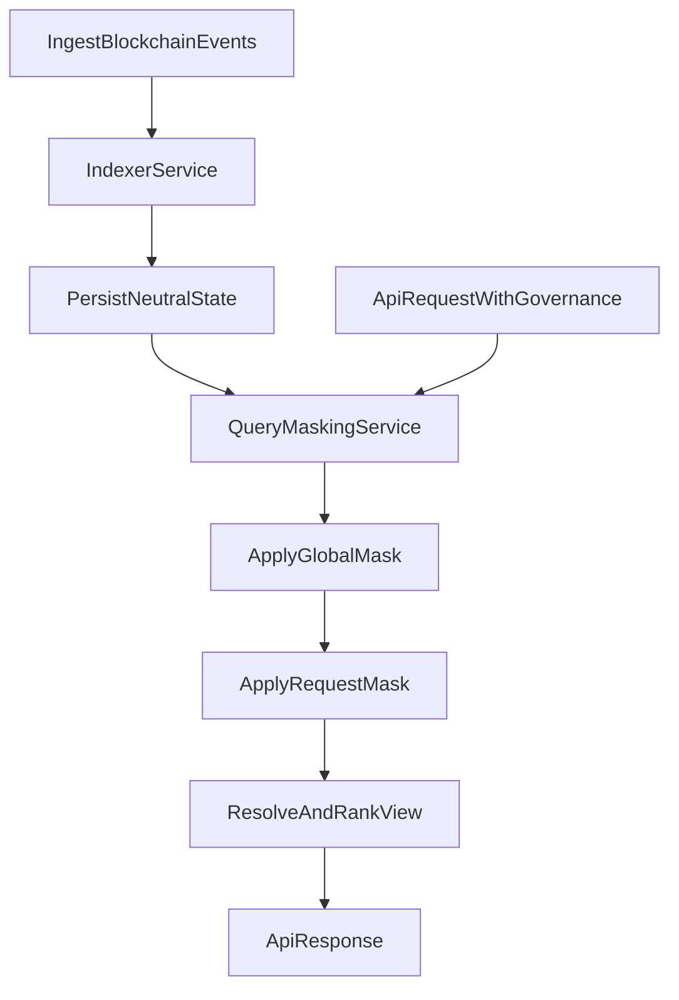

# Project Specification: Open Data V2

## 1. Goal

Define a deterministic architecture for:

- indexing blockchain object/update events,
- resolving competing updates with vote semantics,
- applying governance as request-time masks,
- supporting overflow publishing (Hive baseline + IPFS emergency path, Arweave deferred).

## 2. Service boundary (normative)

### 2.1 Indexer Service

- Reads blockchain events in canonical order:
  `(block_num, trx_index, op_index, transaction_id)`.
- Validates schema/business invariants for write events.
- Stores neutral materialized state without tenant governance masking.
- Parses Hive posts (metadata + body) and stores extracted object references.

### 2.2 Query/Masking Service

- Accepts read request and governance context.
- Resolves governance graph and role scopes.
- Applies global + request governance masks to neutral state.
- Returns filtered and ranked views.

### 2.3 Dashboard/Admin/Billing Service

- Manages user subscriptions, plan tiers, and governance entitlements.
- Stores usage analytics and billing-oriented counters.
- Issues/rotates token policy records consumed by gateway.

### 2.4 API Gateway/Rate-Limit Service

- Validates access tokens and enforces plan limits.
- Applies per-plan speed class, quotas, and rate-limits.
- Records usage statistics and forwards authorized requests to Query/Masking Service.

## 3. ODL event id and core entities

ODL custom_json ids:

- mainnet: `odl-mainnet`
- testnet: `odl-testnet`

All events are sent in one envelope:

- `events[]` items with fields:
  - `action: string`
  - `v: number`
  - `payload: object`

Action set:

- `object_create`
- `update_create`
- `update_vote`
- `rank_vote`

Governance is represented as normal objects with `object_type = governance` (no separate governance namespace).

Core entities:

- `object`: `object_id`, `object_type`, `creator`, `transaction_id`
- `update`: `update_id`, `object_id`, `update_type`, payload fields, `creator`, `transaction_id`
- `vote`: `(update_id, voter) -> effective_vote`
- `rank_vote`: `(update_id, voter, rank_context) -> rank_score`
- `governance declaration`: object with `object_type = governance` that defines roles, trust, and moderation rules
- `object_type` (new entity): type descriptor with:
  - `name` (for example `product`, `recipe`)
  - `supported_updates` (allowed update kinds validated by indexer)
  - `supposed_updates` (automation-intended update kinds; execution mechanism is out of scope for now)

## 4. Indexer write semantics

### 4.1 Object creation

- `object_id` is globally unique.
- First valid `object_create` wins by canonical order.
- Later `object_create` with same `object_id` are rejected with `OBJECT_ALREADY_EXISTS`.
- Governance objects are created through `object_create` with `object_type = governance`.
- Governance object lifecycle is Hive-only (no off-chain direct mutation).

### 4.2 Update and vote semantics

- `update_create` must match the object type policy:
  - target object's `object_type` must exist in `object_type` registry,
  - `update_type` must be listed in that type's `supported_updates`,
  - otherwise reject with `UNSUPPORTED_UPDATE_TYPE`.
- One active raw validity vote per `(update_id, voter)`; revote is replace.
- Indexer stores raw validity votes and canonical event metadata.
- `VALID/REJECTED` is resolved at query time from governance context/snapshot.
- Query-time validity hierarchy:
  1. `owner` always wins.
  2. if owner absent, latest `admin` wins (LWAW).
  3. if owner/admin absent, latest `trusted` wins (LWTW).
- Latest vote is determined by canonical order:
  `(block_num, trx_index, op_index, transaction_id)`.

### 4.2.1 Rank vote semantics (separate channel)

- `rank_vote` does not change `VALID/REJECTED` status.
- `rank_vote` updates ranking channel only.
- One active raw rank vote per `(update_id, voter, rank_context)`; revote is replace.
- `rank_vote` is valid only for target updates of `multi` cardinality.
- For `single` cardinality targets, `rank_vote` must be rejected with `UNSUPPORTED_RANK_TARGET`.
- Hierarchy for decisive ranking signal (same as approve/reject policy):
  1. `owner` always wins.
  2. if owner absent, latest `admin` wins (LWAW).
  3. if owner/admin absent, latest `trusted` wins (LWTW).
- Latest vote is determined by canonical order:
  `(block_num, trx_index, op_index, transaction_id)`.

### 4.3 Governance object ownership rules

- After a governance object is created, only its `creator` may:
  - publish updates targeting that governance object,
  - vote for or against updates targeting that governance object.
- Any governance update/create/vote action by another account is rejected with `UNAUTHORIZED_GOVERNANCE_OP`.

### 4.3.1 Governance references and merged lists

- Governance object may reference other governance objects.
- Referenced role/mute/list data is merged deterministically in query-time resolution.
- Merge precedence is defined by governance resolution algorithm version and must be stable across reindex.

### 4.3.2 Time-bounded trust validity

- Governance supports trust validity cutoff markers (`cutoff_block` preferred; timestamp allowed).
- Actions after trust cutoff are excluded from trusted resolution.
- Historical actions before cutoff remain valid unless separately restricted.

### 4.3.3 Whitelist / blacklist governance updates

- Governance object supports two update categories:
  - `whitelist` updates (override/protection against inherited blocks in allowed scope),
  - `blacklist` updates (future eligibility deny set).
- Final precedence between whitelist/blacklist and global policy is resolved in query layer and must be deterministic.

### 4.4 LWW rule for single fields

- For single-value fields (winner is exactly one value), if the same account publishes a newer update for the same field:
  - the previous update from that same account for that field is removed from current state,
  - the newer update becomes the active contribution from that account for that field.
- This is deterministic last-write-wins behavior scoped to `(object_id, field_key, creator)`.

### 4.5 Object type governance rules

- `object_type` entities are created and updated only through Hive events.
- `object_type` creation is restricted to main governance:
  - only main governance creator may create new `object_type` entities.
- `object_type` update is restricted to main governance:
  - only main governance creator may update existing `object_type` entities.
- Main governance reference is provided by deployment configuration and must be deterministic across indexer instances in one environment.

### 4.6 supported vs supposed updates

- `supported_updates` is normative for indexer validation.
- `supposed_updates` is descriptive metadata for automation opportunities.
- Indexer does not execute automation from `supposed_updates`; it only stores and exposes this metadata.

### 4.7 Hive post parsing and moderation pre-filter

- Indexer parses Hive post metadata and body.
- If a post contains potential object references, indexer stores linkage:
  - `post_id -> object_type`
  - `post_id -> object_ref` (object id/link)
- Muted-based inclusion/exclusion of posts is resolved at query time from governance context/snapshot.

### 4.8 Hive social/account ingestion

Indexer additionally parses and persists Hive operations:

- `mute`
- bulk mute operation (platform-defined governance operation for batch mute writes)
- `follow`
- `unfollow`
- `reblog`
- `create_account`
- `update_account` (v1/v2)

Normalization rules:

- `follow` / `unfollow` must be materialized as current edge state.
- `mute` must be materialized as current mute state.
- `reblog` must be stored as evented relation between account and post.
- account v1/v2 payloads must be normalized into one account projection record.

Current required account projection fields:

- `name`
- `alias`
- `json_metadata` (raw)
- `profile_image` extracted from `json_metadata`

## 5. Query-time governance masking

### 5.1 Mask inputs

Each response is filtered by two governance layers:

1. Platform/global policy mask (mandatory baseline).
2. Request governance mask (provided directly or resolved from subscription profile).

### 5.2 Precedence

- Global mask always has higher priority.
- Request mask may narrow but never override global restrictions.

### 5.3 Domains

- Data domain roles: `owner`, `admin`, `trusted`.
- Social domain role: `moderator`.
- Domain-specific effects are defined in `spec/governance_resolution.md`.

### 5.4 Two-phase query execution

1. Candidate phase:
   - Apply text + geo + structural filters to neutral indexes.
   - Produce bounded candidate set with base relevance score.
2. Governance phase:
   - Resolve `resolved_governance_snapshot`.
   - Apply global + request governance masks.
   - Compute final winners and ranking.

## 6. Governance resolution and caching

- Governance objects are indexed as neutral declarations.
- Query service computes an effective governance set for each governance input.
- Effective governance sets are cached.
- Cache invalidation is required when:
  - referenced governance objects change,
  - trust graph edges change,
  - role assignments relevant to the computed set change.

## 7. Overflow publishing strategy

- Default path: publish via Hive.
- Emergency path: publish via IPFS for:
  - large initial import,
  - queue backlog drain.
- Arweave is deferred and retained as future permanence extension point.
- Operational behavior (thresholds, confirmation polling, TTL, retries) is defined in `spec/overflow_strategy.md`.

## 8. Logical storage model

- `events_log` (canonical raw events + apply/reject result)
- `objects_current`
- `updates_current`
- `update_votes_raw_current`
- `rank_votes_raw_current`
- `governance_objects_current`
- `governance_resolution_cache` (query layer)
- `query_policy_profiles` (optional mapping for subscription governance defaults)
- `governance_references_current`
- `governance_list_overrides_current` (whitelist/blacklist)
- `governance_trust_cutoffs_current`
- `posts_parsed_current`
- `post_object_links`
- `social_follows_current`
- `social_mutes_current`
- `social_reblogs_log`
- `accounts_current` (normalized v1/v2 projection)

## 9. Processing flow

## 10. Acceptance criteria (high level)

- Reindexing same stream produces identical neutral state and reject log.
- Same neutral state with different governance inputs can produce different masked output.
- Same neutral state with same governance inputs always produces identical output.
- Global policy restrictions cannot be bypassed by request governance.
- Overflow policy switches to IPFS when configured thresholds are exceeded.
- Governance object updates/votes are accepted only from governance object creator.
- For single fields, repeated updates by same creator resolve via deterministic LWW.
- Only main governance can create/update `object_type` entities.
- `update_create` is accepted only when `update_type` is listed in `supported_updates` for target object type.
- Hive social/account operations (`mute`, `follow/unfollow`, `reblog`, `create_account`, `update_account v1/v2`) are parsed deterministically into dedicated datasets.
- Post inclusion/exclusion by muted rules is resolved in query layer from governance context/snapshot.
- Governance references are resolved deterministically with stable merge outputs.
- Trust cutoff excludes post-cutoff trusted actions while preserving historical pre-cutoff actions.
- Plan/gateway policy enforcement deterministically limits governance entitlements by subscription tier.

## 10.1 Non-functional targets

- Query service target latency: `P95 < 200ms` for standard two-phase query execution under production workload profile.
- Indexer capacity target:
  - at least `10,000,000` object creates/day,
  - at least `350,000,000` update creates/day.
- Capacity compliance may be achieved via horizontal scaling, but deterministic behavior requirements remain unchanged.

## 11. Deterministic final ranking formula

Final ranking must be deterministic and stable for identical inputs.

For each candidate after governance masking:

- `final_score = (w_text * text_score) + (w_geo * geo_score) + (w_vote * normalized_vote_weight) + (w_rank * normalized_rank_score) + freshness_bonus`

Tie-break order (mandatory):

1. `final_score DESC`
2. `rank_score DESC`
3. decisive rank vote canonical order (`block_num DESC`, `trx_index DESC`, `op_index DESC`, `transaction_id DESC`)
4. `normalized_vote_weight DESC`
5. update canonical order (`block_num DESC`, `trx_index DESC`, `op_index DESC`, `transaction_id DESC`)
6. `update_id ASC`

Where:

- weights (`w_text`, `w_geo`, `w_vote`, `w_rank`) are versioned configuration,
- freshness function and normalization are versioned configuration,
- ranking config version must be included in query metadata and cache key.

## 12. Governance and billing coupling

- Platform governance is always base layer.
- User/tenant governance is applied on top, but entitlement to custom governance features is plan-bound.
- Gateway enforces governance entitlements from subscription policy before forwarding request to query service.
- Trusted status may include billing/subscription contribution signals as auxiliary factors, but decisive role rules remain governance-driven.

