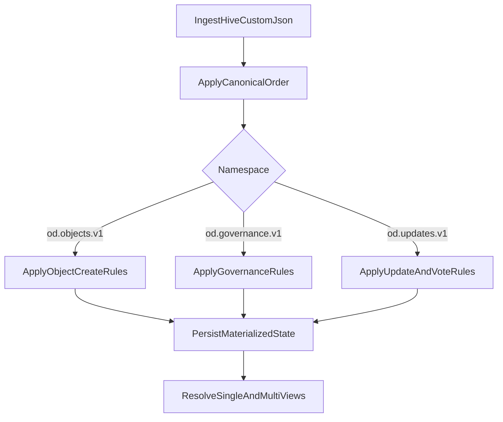

# Спецификация проекта: консенсус апдейтов объектов в Hive

## 1. Цель

Детерминированная система для:

- создания объектов,
- обработки конкурирующих апдейтов,
- governance/ролей и голосования с весом.

## 2. Сущности

- `object`: `object_id`, `transaction_id`, `object_type`, `creator`
- `update`: `update_id`, `object_id`, `update_type`, `name`, `body`, `locale`, `creator`, `transaction_id`
- `vote`: голос аккаунта за `update_id`

## 3. Создание объектов 

Namespace: `custom_json.id = "od.objects.v1"`

### 3.1 Событие `object_create`

Обязательные поля payload:

- `v`, `action="object_create"`
- `object_id`
- `object_type`
- `creator`
- `transaction_id`

### 3.2 Правила валидации

- `object_id` задается инициатором (`creator`) в payload.
- Глобальная уникальность `object_id` обязательна.
- Если объект с таким `object_id` уже существует в materialized state, событие отклоняется.
- Объект не создается повторно ни при каких условиях.

Reject-коды:

- `OBJECT_ALREADY_EXISTS`
- `INVALID_OBJECT_PAYLOAD`

### 3.3 Детерминизм при гонке двух `object_create` с одинаковым `object_id`

События применяются в каноническом порядке:
`(block_num, trx_index, op_index, transaction_id)`.

- Первое валидное `object_create` создает объект.
- Все последующие `object_create` с тем же `object_id` отклоняются как `OBJECT_ALREADY_EXISTS`.

## 4. Governance и роли (RBAC)

Namespace: `od.governance.v1`

- `create_committee` (только один раз)
- `grant_role`
- `revoke_role`

### 4.1 Участники governance (governance participants)

Для правил, зависящих от «участника governance» (в т.ч. проверка muted list при create-операциях), участниками считаются:

- **Члены комитета** — аккаунты из списка `members` единственного применённого `create_committee`.
- **Держатели governance-ролей** — аккаунты, у которых на момент проверки есть активная роль, выданная через governance (grant_role), в scope, релевантном данной проверке.

Итого: **governance participants = committee members + governance-role holders**.

Bootstrap:

- первый валидный `create_committee` от `bootstrap_allowlist` фиксирует genesis.
- дальнейшие `create_committee` отклоняются (`DUPLICATE_GENESIS`).

## 5. Апдейты и голоса

Namespace: `od.updates.v1`

- `update_create`: стартует с `weight=0`, `status=VALID`
- `update_vote`: учитывается только при валидной роли на момент события

Revote:

- один активный голос на `(update_id, voter)`
- повторный голос = replace
- `delta = new_effective_vote - old_effective_vote`
- `weight += delta`

Статус динамический:

- `VALID`, если `weight >= 0`
- `REJECTED`, если `weight < 0`

## 6. Резолв чтения

- `single`-типы: 1 лучший `VALID` (max `weight`, затем tie-break)
- `multi`-типы: до 10 лучших `VALID` (sort by `weight DESC`, tie-break)

## 7. Модель хранения (логическая)

- `objects_current` (`object_id` PK, `object_type`, `creator`, `created_tx_id`, `created_block`)
- `updates_current`
- `update_votes_current`
- `roles_current`
- `events_log`
- `governance_state`

## 8. Поток обработки

## 9. Acceptance criteria

- Повторный reindex дает идентичный state/hash.
- При двух `object_create` с одинаковым `object_id` создается только один объект (первый по каноническому порядку).
- Повторный `object_create` всегда отклоняется с `OBJECT_ALREADY_EXISTS`.
- Revote корректно делает replace.
- Динамический статус `VALID/REJECTED` корректно меняется при пересечении нуля.

